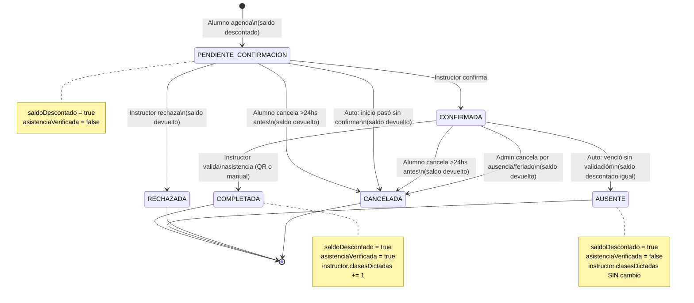
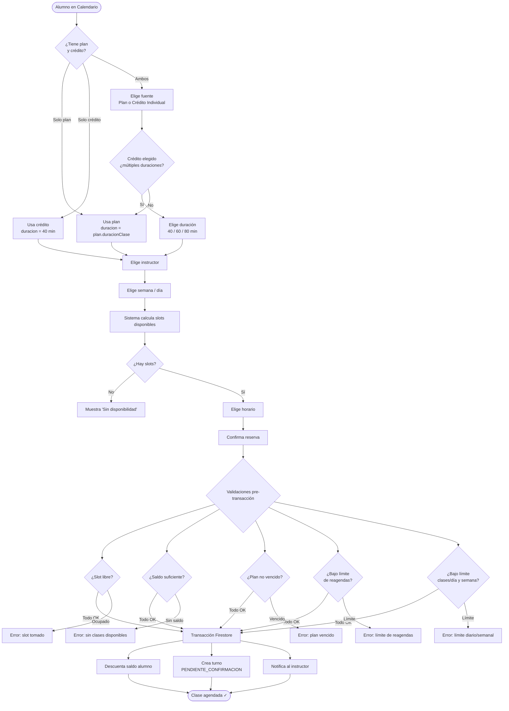
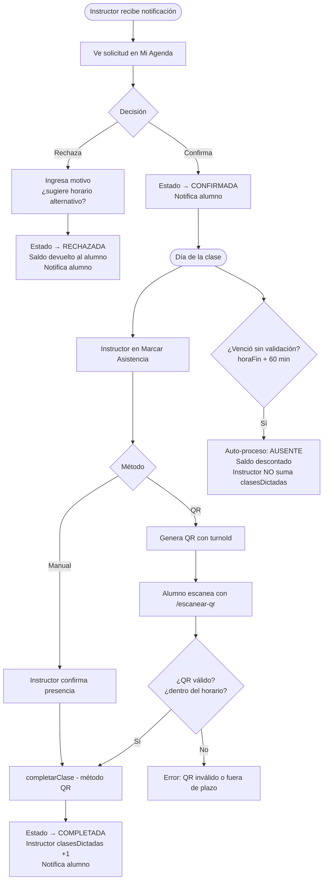
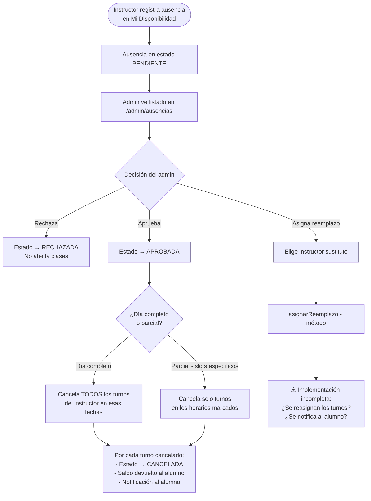
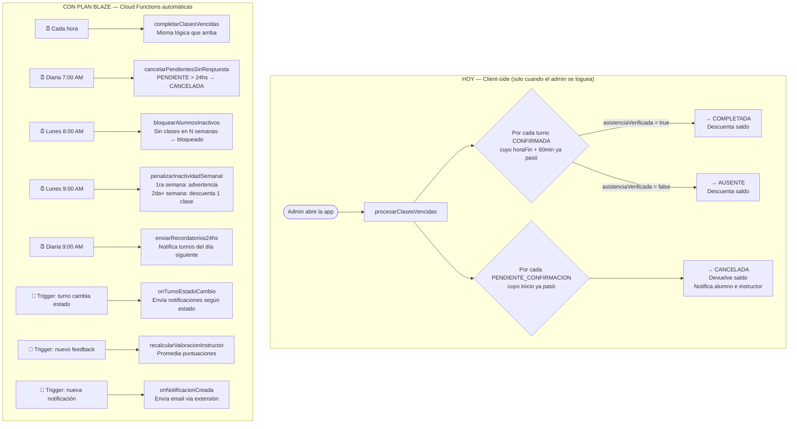
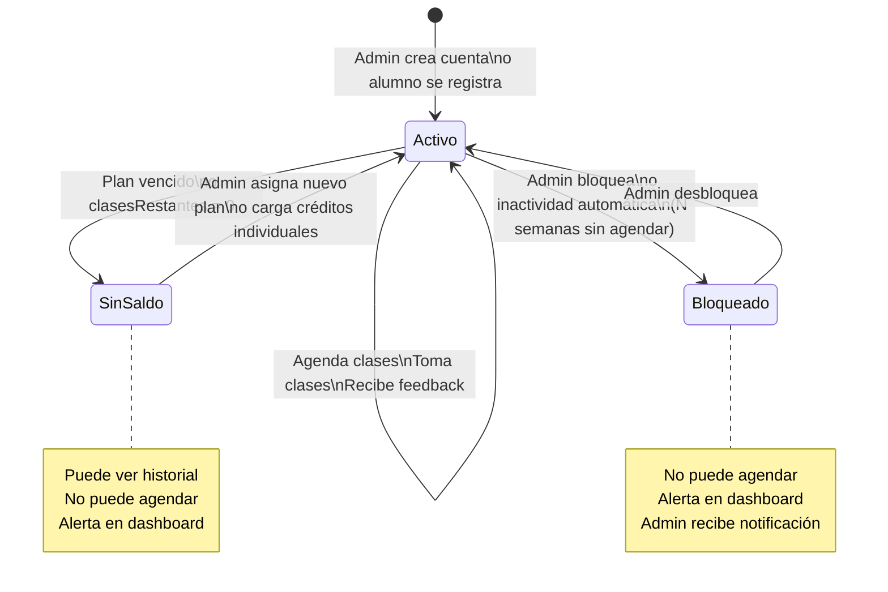
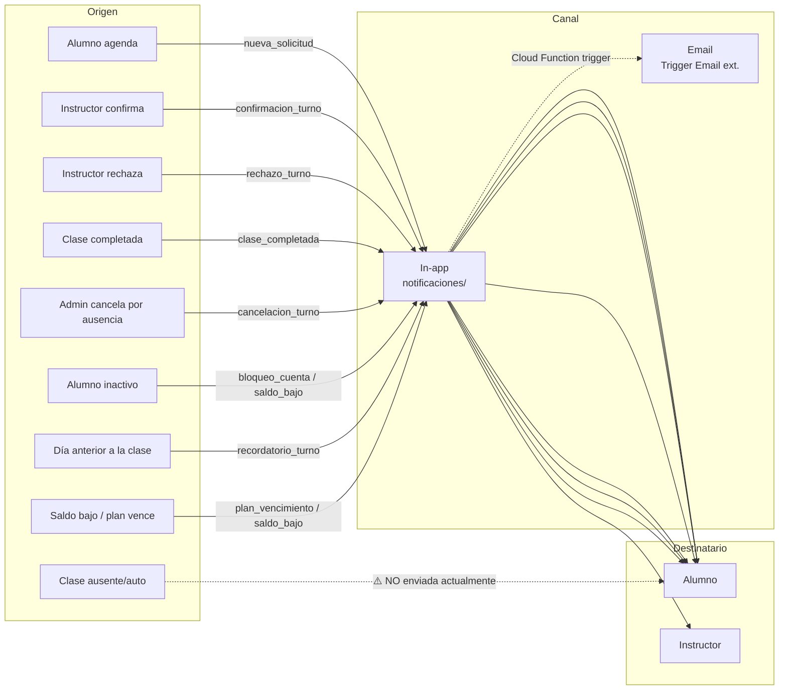
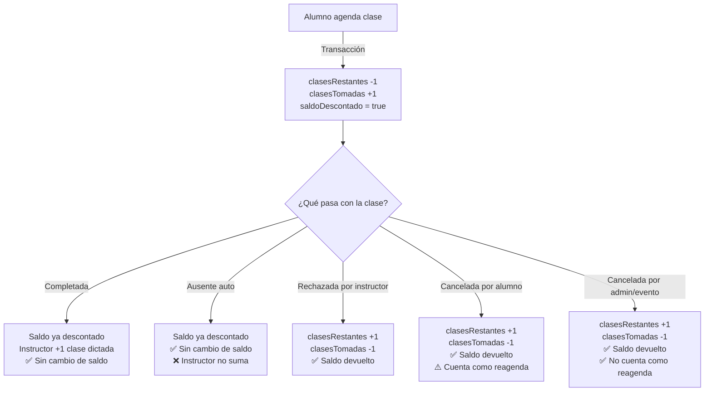

# Flujos de la aplicación — AutoEscuela IA

> Diagramas generados: 2026-04-26  
> Renderizar con: VS Code + extensión "Markdown Preview Mermaid Support", GitHub, o Obsidian.

---

## 1. Mapa de roles y pantallas

```mermaid
graph TD
    Login[/login] --> A{Rol del usuario}

    A -->|alumno| AL[Layout Alumno]
    A -->|instructor| IN[Layout Instructor]
    A -->|admin| AD[Layout Admin]
    A -->|super-admin| SAD[Layout Admin\n+ opciones extra]

    AL --> AL1[Mi Cuenta / Dashboard]
    AL --> AL2[Calendario]
    AL --> AL3[Mis Turnos]
    AL --> AL4[Escanear QR]
    AL --> AL5[Mi Saldo]
    AL --> AL6[Historial]
    AL --> AL7[Calificar Clases]
    AL --> AL8[Asignación masiva]

    IN --> IN1[Mi Cuenta / Dashboard]
    IN --> IN2[Mi Agenda]
    IN --> IN3[Marcar Asistencia]
    IN --> IN4[Mi Disponibilidad]

    AD --> AD1[Principal / Dashboard]
    AD --> AD2[Alumnos]
    AD --> AD3[Instructores]
    AD --> AD4[Clases y turnos]
    AD --> AD5[Asignar clases]
    AD --> AD6[Reportes]
    AD --> AD7[Ausencias]
    AD --> AD8[Feriados]
    AD --> AD9[Configuración]

    SAD --> SAD1[Sucursales]
    SAD --> SAD2[Administradores]
    SAD --> SAD3[Cambiar sucursal]
```

---

## 2. Estados de un turno — máquina de estados



> ⚠️ **Estado REPROGRAMADA**: definido en el tipo `TurnoEstado` pero nunca usado en el código. Pendiente de decidir si se implementa o se elimina del modelo.

---

## 3. Flujo completo de reserva de clase (alumno)



---

## 4. Flujo de confirmación y asistencia (instructor)



---

## 5. Flujo de ausencia del instructor (admin)



> ⚠️ **Gap detectado**: el método `asignarReemplazo` existe pero no reasigna los turnos existentes ni notifica a los alumnos afectados. Si se va a usar esta funcionalidad, hay que completarla.

---

## 6. Procesos automáticos y cuándo corren



> ⚠️ **Inconsistencia detectada**: la Cloud Function `cancelarPendientesSinRespuesta` cancela si `creadoEn < hace 24hs`, pero el cliente cancela si `inicioYaPaso` (la hora de inicio pasó). Son reglas distintas. Definir cuál aplica antes de deployar.

---

## 7. Ciclo de vida del alumno



---

## 8. Flujo de notificaciones



> ⚠️ **Gap detectado**: cuando una clase pasa a AUSENTE por vencimiento automático, el alumno **no recibe notificación**. Solo se notifica cuando un PENDIENTE se cancela por falta de confirmación del instructor. Agregar notificación en `marcarAusente()`.

---

## 9. Lógica de saldo — resumen visual



---

## 10. Gaps y comportamientos a revisar

| # | Descripción | Impacto | Estado |
|---|---|---|---|
| 1 | ~~Sin notificación al marcar AUSENTE automáticamente~~ | — | ✅ Resuelto — notificación agregada en `marcarAusente()` y `scheduler.ts` |
| 2 | ~~`asignarReemplazo` incompleto~~ | — | ✅ Resuelto — funcionalidad eliminada |
| 3 | ~~Estado REPROGRAMADA nunca usado~~ | — | ✅ Resuelto — eliminado del modelo y del pipe |
| 4 | **Inconsistencia cancelación PENDIENTE**: cliente vs Cloud Function | Comportamiento distinto según quién corra el proceso | Pendiente — definir antes de activar Blaze (ver `CLOUD_FUNCTIONS_PRODUCCION.md`) |
| 5 | **Crédito individual: UI solo muestra 40 min** | El modelo soporta otras duraciones pero no hay forma de agendarlas | Pendiente — decisión de negocio |
| 6 | **Sin flujo de re-agendar cuando instructor rechaza con horario sugerido** | Alumno recibe notificación con hora sugerida pero debe buscarla manualmente | Pendiente — mejora de UX futura |
| 7 | **Sin renovación automática de plan** | Al vencer, el alumno queda sin saldo hasta que el admin actúe | Aceptado — renovación manual por ahora |
| 8 | **Proceso automático solo corre al login del admin** | Clases del día pueden quedar en CONFIRMADA si el admin no se loguea | Resuelto al activar Blaze (ver `CLOUD_FUNCTIONS_PRODUCCION.md`) |
| 9 | **`eliminar` en usuario.service borra solo Firestore** | La cuenta de Firebase Auth queda huérfana | Resuelto al activar Blaze — usar CF `eliminarUsuario` (ver `CLOUD_FUNCTIONS_PRODUCCION.md`) |
| 10 | **`procesarClasesVencidas` quedará duplicado con Blaze** | Doble procesamiento al hacer deploy | Resuelto al activar Blaze — eliminar llamada en `admin-layout` (ver `CLOUD_FUNCTIONS_PRODUCCION.md`) |
